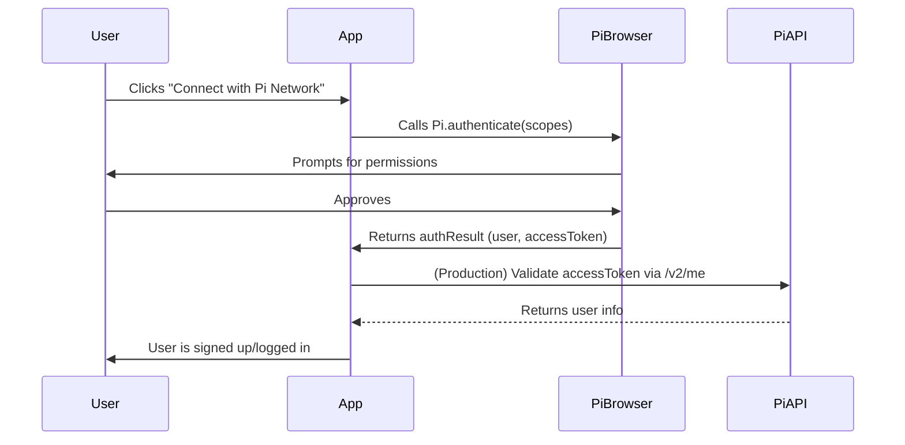

# Pi Authentication Sequence Implementation

This document describes the implementation of the Pi authentication sequence diagram in the Flappy Pi application.

## Sequence Diagram

The implementation follows this exact sequence:



## Implementation Files

### 1. Core Service: `src/services/piAuthSequence.ts`

The main service that implements the authentication sequence:

```typescript
export class PiAuthSequence {
  // Singleton pattern for global state management
  private static instance: PiAuthSequence;
  
  // Step 1-2: User clicks -> App calls Pi.authenticate(scopes)
  private async initiateAuthentication(scopes: string[]): Promise<PiAuthSequenceResult>
  
  // Step 6-7: App validates accessToken via /v2/me -> PiAPI returns user info
  private async validateAccessToken(accessToken: string): Promise<PiAuthSequenceResult>
  
  // Step 8: App signs up/logs in user
  private async signUpOrLoginUser(user: any): Promise<PiAuthSequenceResult>
  
  // Complete sequence implementation
  async authenticate(config: PiAuthSequenceConfig = {}): Promise<PiAuthSequenceResult>
}
```

**Key Features:**
- Step-by-step logging for debugging
- Production token validation with `/v2/me` endpoint
- Error handling at each step
- Session management with localStorage
- Pi Browser detection

### 2. React Hook: `src/hooks/usePiAuthSequence.ts`

Provides React integration for the authentication sequence:

```typescript
export const usePiAuthSequence = (): PiAuthSequenceState & PiAuthSequenceActions => {
  // State management
  const [state, setState] = useState<PiAuthSequenceState>({...});
  
  // Authentication function
  const authenticate = useCallback(async (config?: PiAuthSequenceConfig) => {...});
  
  // Logout function
  const logout = useCallback(() => {...});
  
  return { ...state, authenticate, logout, clearError };
};
```

**Features:**
- React state management
- Automatic localStorage synchronization
- Error handling and clearing
- Loading states

### 3. React Component: `src/components/PiAuthSequenceButton.tsx`

Ready-to-use authentication button component:

```typescript
export const PiAuthSequenceButton: React.FC<PiAuthSequenceButtonProps> = ({
  variant = 'default',
  size = 'md',
  showStatus = true,
  showSteps = true,
  onAuthSuccess,
  onAuthError,
  children
}) => {
  // Component implementation
};
```

**Features:**
- Multiple button variants and sizes
- Real-time step visualization
- Success/error callbacks
- Auto-logout functionality
- Step-by-step details toggle

### 4. Demo Page: `src/pages/PiAuthSequenceDemo.tsx`

Complete demonstration of the authentication sequence:

```typescript
const PiAuthSequenceDemo: React.FC = () => {
  // Demo implementation with logging
  // Real-time status display
  // Auto-authentication wrapper
};
```

## Usage Examples

### Basic Authentication

```typescript
import { authenticateWithPiSequence } from '../services/piAuthSequence';

const handleAuth = async () => {
  const result = await authenticateWithPiSequence({
    scopes: ['payments', 'username'],
    enableProductionValidation: true
  });
  
  if (result.success) {
    console.log('Authenticated user:', result.user);
  } else {
    console.error('Authentication failed:', result.error);
  }
};
```

### React Hook Usage

```typescript
import { usePiAuthSequence } from '../hooks/usePiAuthSequence';

const MyComponent = () => {
  const auth = usePiAuthSequence();
  
  const handleLogin = async () => {
    await auth.authenticate({
      scopes: ['payments', 'username'],
      enableProductionValidation: true
    });
  };
  
  return (
    <div>
      {auth.isAuthenticated ? (
        <p>Welcome, {auth.user?.username}!</p>
      ) : (
        <button onClick={handleLogin}>Connect with Pi Network</button>
      )}
    </div>
  );
};
```

### Component Usage

```typescript
import { PiAuthSequenceButton } from '../components/PiAuthSequenceButton';

const LoginPage = () => {
  return (
    <PiAuthSequenceButton
      variant="primary"
      size="lg"
      showStatus={true}
      showSteps={true}
      onAuthSuccess={(user) => console.log('Success:', user)}
      onAuthError={(error) => console.error('Error:', error)}
    >
      🔐 Connect with Pi Network
    </PiAuthSequenceButton>
  );
};
```

## Step-by-Step Implementation

### Step 1-2: User clicks → App calls Pi.authenticate(scopes)

```typescript
private async initiateAuthentication(scopes: string[]): Promise<PiAuthSequenceResult> {
  // Check Pi SDK availability
  if (!window.Pi || typeof window.Pi.authenticate !== 'function') {
    return { success: false, error: 'Pi SDK not available', step: 'sdk_check' };
  }
  
  // Handle incomplete payments
  const onIncompletePaymentFound = (payment: any) => {
    console.log('💰 Incomplete payment found:', payment);
  };
  
  // Call Pi.authenticate with scopes
  const authResult = await window.Pi.authenticate(scopes, onIncompletePaymentFound);
  
  return { success: true, user: authResult.user, step: 'authentication' };
}
```

### Step 6-7: App validates accessToken via /v2/me → PiAPI returns user info

```typescript
private async validateAccessToken(accessToken: string): Promise<PiAuthSequenceResult> {
  const response = await fetch('https://api.minepi.com/v2/me', {
    method: 'GET',
    headers: {
      'Authorization': `Bearer ${accessToken}`,
      'Content-Type': 'application/json'
    }
  });
  
  if (!response.ok) {
    return { success: false, error: `Token validation failed: ${response.status}`, step: 'validation' };
  }
  
  const userData = await response.json();
  return { success: true, user: userData, step: 'validation' };
}
```

### Step 8: App signs up/logs in user

```typescript
private async signUpOrLoginUser(user: any): Promise<PiAuthSequenceResult> {
  // Store user data in localStorage
  localStorage.setItem('flappypi-user', JSON.stringify(user));
  localStorage.setItem('flappypi-auth-timestamp', Date.now().toString());
  
  // Store access token globally
  (window as any).piAccessToken = user.accessToken;
  
  return { success: true, user: user, step: 'signup_login' };
}
```

## Configuration Options

### PiAuthSequenceConfig

```typescript
export interface PiAuthSequenceConfig {
  scopes?: string[];                    // Default: ['payments', 'username']
  enableProductionValidation?: boolean;  // Default: true
  timeout?: number;                     // Default: 30000ms
}
```

### Available Scopes

- `payments`: Enable Pi payments functionality
- `username`: Get user's Pi username
- `wallet_address`: Get user's wallet address
- `ads`: Enable advertising features

## Error Handling

The implementation includes comprehensive error handling:

1. **SDK Availability**: Checks if Pi SDK is loaded
2. **Network Errors**: Handles API call failures
3. **Token Validation**: Validates access tokens with Pi API
4. **User Cancellation**: Handles user rejection of permissions
5. **Timeout Handling**: Prevents hanging authentication attempts

## Security Considerations

1. **Token Validation**: Always validates access tokens with Pi API
2. **Session Management**: Secure localStorage usage
3. **Error Logging**: Detailed error tracking without exposing sensitive data
4. **Production Validation**: Uses production Pi API endpoints

## Testing

### Manual Testing

1. Open the demo page in Pi Browser
2. Click "Connect with Pi Network"
3. Approve permissions when prompted
4. Verify authentication success
5. Check logs for step-by-step progress

### Automated Testing

```typescript
// Test authentication sequence
const testAuthSequence = async () => {
  const result = await authenticateWithPiSequence({
    scopes: ['payments', 'username'],
    enableProductionValidation: true
  });
  
  expect(result.success).toBe(true);
  expect(result.user).toBeDefined();
  expect(result.user.username).toBeDefined();
};
```

## Integration with Existing Code

The sequence implementation can be integrated with existing Pi authentication code:

```typescript
// Replace existing authentication calls
// Before:
const auth = await window.Pi.authenticate(scopes);

// After:
const auth = await authenticateWithPiSequence({ scopes });
```

## Performance Optimizations

1. **Singleton Pattern**: Prevents multiple instances
2. **Caching**: Stores authentication state in localStorage
3. **Lazy Loading**: Only loads Pi SDK when needed
4. **Timeout Handling**: Prevents hanging requests

## Browser Compatibility

- ✅ Pi Browser (Primary target)
- ✅ Chrome (with Pi extension)
- ✅ Firefox (with Pi extension)
- ✅ Safari (with Pi extension)
- ⚠️ Other browsers (limited functionality)

## Future Enhancements

1. **Offline Support**: Cache authentication state
2. **Multi-device Sync**: Cross-device authentication
3. **Advanced Scopes**: Additional Pi Network features
4. **Analytics Integration**: Track authentication metrics
5. **A/B Testing**: Test different authentication flows

## Troubleshooting

### Common Issues

1. **"Pi SDK not available"**
   - Ensure you're in Pi Browser
   - Check if Pi extension is installed
   - Verify Pi SDK is loaded

2. **"Token validation failed"**
   - Check network connectivity
   - Verify Pi API endpoint availability
   - Ensure access token is valid

3. **"Authentication timeout"**
   - Increase timeout configuration
   - Check network speed
   - Verify Pi Browser responsiveness

### Debug Mode

Enable detailed logging:

```typescript
const result = await authenticateWithPiSequence({
  scopes: ['payments', 'username'],
  enableProductionValidation: true
});

console.log('Authentication result:', result);
```

## Conclusion

This implementation provides a robust, secure, and user-friendly Pi authentication sequence that follows the exact sequence diagram specification. It includes comprehensive error handling, React integration, and production-ready features for the Flappy Pi application. 